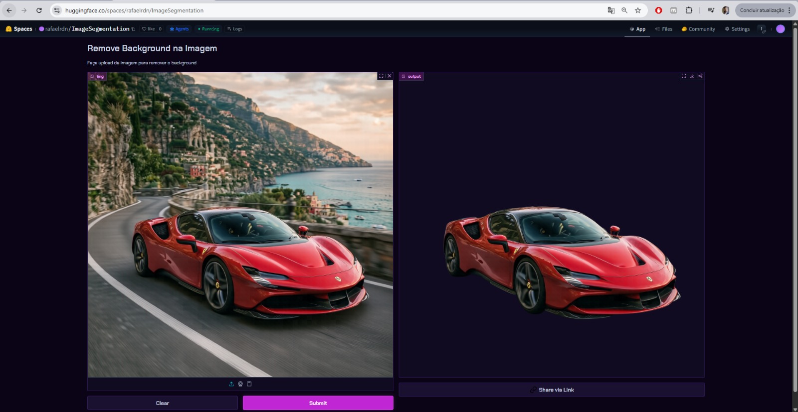

# AI Image Background Remover

An AI-powered image segmentation application that removes image backgrounds automatically using the `briaai/RMBG-1.4` model from Hugging Face.

The application was developed with Python, Transformers, PyTorch, and Gradio.

---

## Features

* Automatic background removal
* AI image segmentation
* Simple and modern web interface
* Upload and process images instantly
* Hugging Face Spaces deployment
* Dark mode interface

---

## Technologies Used

* Python
* PyTorch
* Transformers
* Gradio
* Hugging Face Hub
* NumPy
* Pillow

---

## AI Model

This project uses the following model from Hugging Face:

* `briaai/RMBG-1.4`

The model performs high-quality foreground segmentation for removing image backgrounds.

---

## Installation

Clone the repository:

```bash
git clone https://github.com/rafaelraah/imageSegmentation.git
```

Enter the project folder:

```bash
cd YOUR_REPOSITORY
```

Create a virtual environment:

```bash
python -m venv .venv
```

Activate the environment:

### Windows

```bash
.venv\Scripts\activate
```

### Linux / Mac

```bash
source .venv/bin/activate
```

Install dependencies:

```bash
pip install -r requirements.txt
```

---

## Run the Application

```bash
python app.py
```

---

## Project Structure

```txt
├── app.py
├── requirements.txt
├── README.md
└── runtime.txt
```

---

## Screenshots



---

## Deployment

This project can be deployed using:

* Hugging Face Spaces
* Streamlit Cloud
* Docker
* VPS servers
* Cloud platforms

---

## License

This project is for educational and experimental purposes.

Please verify the license terms of the AI model before commercial use.

---

## Author

Rafael Nascimento

Software Architect specialized in:

* .NET
* C#
* JavaScript
* Python
* Java
* Microservices
* APIs
* DevOps
* Docker
* Kubernetes
* AI applications
* Academic systems development
* Digital game development